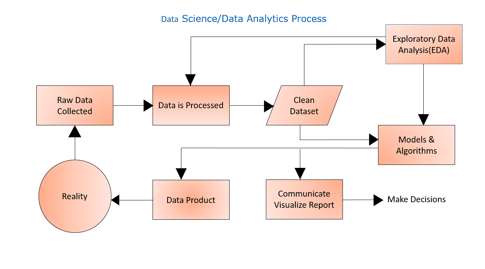

# Credit-Banking-Spending-Patterns-and-Customer-Acquisition

# Features
⚡Python Programming Language 
⚡EDA [For insights gathering and analysis] 
⚡Pandas [For working with datasets/For analyzing, cleaning, exploring, and manipulating data] 
⚡Matplotlib & Seaborn [For answer some business questions in the form of visuals] 
⚡Statistics [For calculating  mathematical statistics of numeric data]
    
# TABLE OF CONTENTS
<ul>
    <li><h4>ACKNOWLEDGMENT</h4></li>
</ul>
<ol><li><h4>INTRODUCTION</h4></li>
    <ol type="i">
      <li>About The Project</li>
      <li>Scope</li>
      <li>About the Organization</li>
    </ol>
    <li><h4>DATASET USED</h4></li>
    <ol type="i">
      <li>Customer Acquisition</li>
      <li>Spend</li>
      <li>Repayment</li>
    </ol>
    <li><h4>DATA ANALYTICS PROCESS</h4></li>
    <li><h4>METHODOLOGY</h4></li>
    <ol type="i">
    <li>Objective</li>
    <li>Data Gathering</li>
    <li>Data Cleaning</li>
    <li>Field Level Analysis</li>
        <ol>
            <li>Missing Value Treatement</li>
            <li>Handling Outliers</li>
            <li>Data Type Analysis</li>
        </ol>
    <li>Data Consolidation</li>
        <ol>
            <li>Merging Data</li>
            <li>Defining Relationship In Data</li>
        </ol>
    <li>Data Analysis And Business Insides</li>    
</ol>

## ACKNOWLEDGMENT

There are many people who contributed to my work on this Project. I owe my gratitude to all of 
them who have made this Project possible.

 I am grateful to the entire team at <b>Edulyt India</b> for providing necessary facilities and permitting me to carry out this project in the organization. I would especially like to thank <b>Mr. Lalit 
Chaudhary</b> for providing me this wonderful opportunity to work on this project and for their 
continuous guidance and support throughout the project.

## INTRODUCTION
### About The Project -
### Scope
### About the Organization - 

    Edulyt India is an early age start-up working towards reducing the Gap between Education & 
Employment, founded in 2015 with a mission to train fresh graduates. Disrupting the education 
management sector mainly focused on the field of Analytics. 
Our core area of working is in Data Analytics for BFSI domain. 
Our team is working on basic AI tools to make the world a better easier place to live. Our core 
expertise lies in making the Graduates industry ready. We are highly skilled and trained in 
delivering training to aspiring Graduates. 

## DATASET USED

  <table class="w3-table-all w3-card-4">
    <tr>
      <th>Field</th>
      <th>Description</th>
    </tr>
    <tr>
      <td>Sl No:</td>
      <td>Count of rows</td>
    </tr>
    <tr>
      <td>Customer</td>
      <td>Name of Customer</td>
    </tr>
    <tr>
      <td>Age</td>
      <td>Age of Customer</td>
    </tr>
    <tr>
      <td>City</td>
      <td>Customer's City</td>
    </tr>
    <tr>
        <td>Credit Card Product</td>
        <td>Types of Credit Cards</td>
    </tr>
    <tr>
        <td>Limit</td>
        <td>Credit Card Limit</td>
    </tr>
    <tr>
        <td>Company</td>
        <td>Name of the Company</td>
    </tr>
    <tr>
        <td>Segment</td>
        <td>Customer Occupation</td>
    </tr>    
  </table>

<i><b>Table-1 : Customer Acqusition</b></i>

 
  <table class="w3-table-all w3-card-4">
    <tr>
      <th>Field</th>
      <th>Description</th>
    </tr>
    <tr>
      <td>Sl No:</td>
      <td>Count of rows</td>
    </tr>
    <tr>
      <td>Costomer</td>
      <td>Name of Customer</td>
    </tr>
    <tr>
      <td>Month</td>
      <td>Date</td>
    </tr>
    <tr>
      <td>Type</td>
      <td>Types of Expenses</td>
    </tr>
    <tr>
        <td>Amount</td>
        <td>Spend of Customer</td>
    </tr>
  </table>

<i><b>Table-2 : Spend</b></i>

 
  <table class="w3-table-all w3-card-4">
    <tr>
      <th>Field</th>
      <th>Description</th>
    </tr>
    <tr>
      <td>SL No:</td>
      <td>Count of rows</td>
    </tr>
    <tr>
      <td>Costomer</td>
      <td>Name of Customer</td>
    </tr>
    <tr>
      <td>Month</td>
      <td>Credit Card Payment Date</td>
    </tr>
    <tr>
        <td>Amount</td>
        <td>Credit Card Payment Amount</td>
    </tr>
  </table>

<i><b>Table-3 : Repayment</b></i>

## DATA ANALYTICS PROCESS

## METHODOLOGY
### Objective
### Data Gathering or Collection - 

Data collection is the methodological process of gathering information. Collecting data is an 
integral part of a business’s success. it can enable us to ensure the data’s accuracy, completeness, and relevance to our organization and the issue at hand. The information gathered allows organizations to analyze past strategies and stay informed on what needs to change.

In this project we will use “Credit Banking Dataset”.Which is an Excel workbook (.xlsx) file.

             

